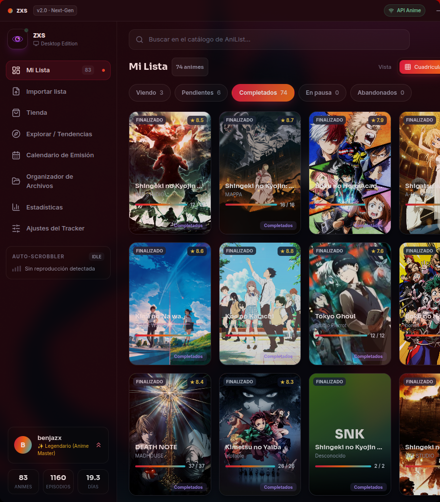
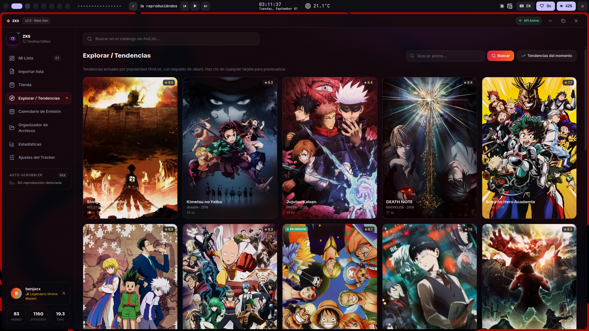
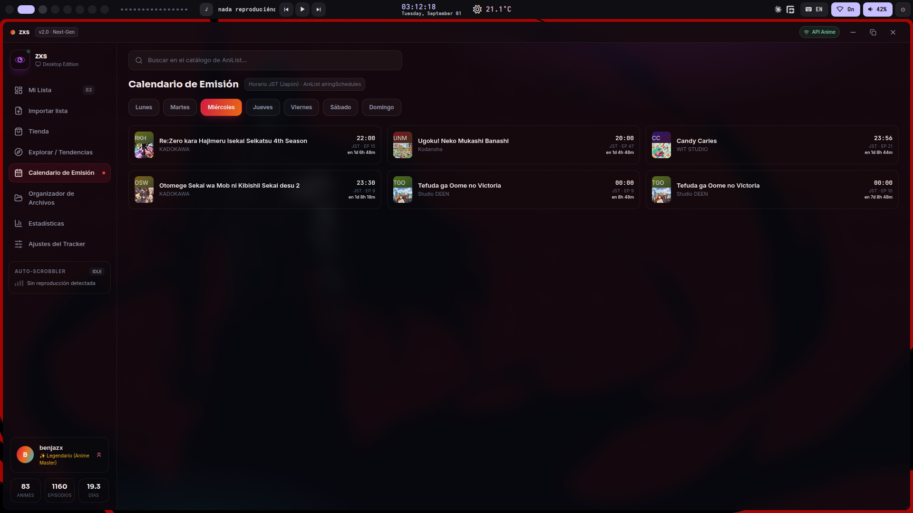
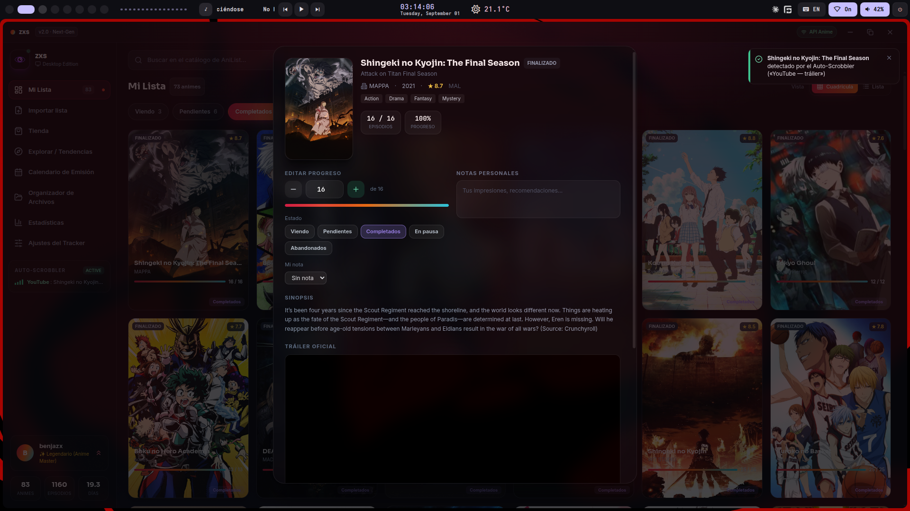
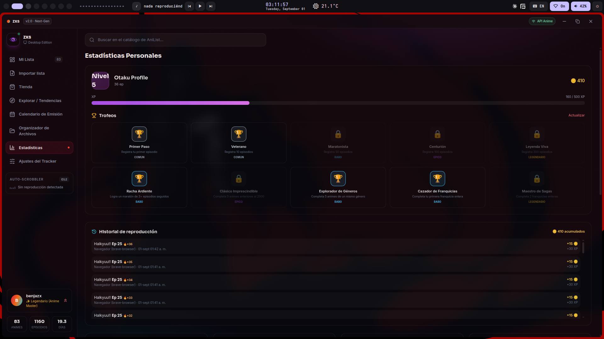
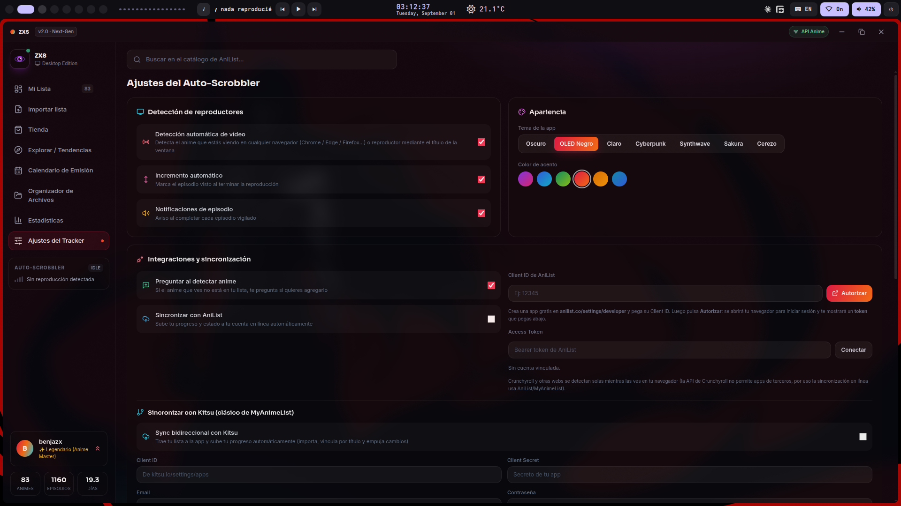

# AnimePulse

**Versión estable actual: v2.0.8** · [Descargar AppImage](https://github.com/benjitaa98h/AnimePulse-Desktop/releases/download/v2.0.8/AnimePulse-2.0.8.AppImage)

**Novedades destacadas en v2.0.8:** los animes en emisión resueltos vía Jikan ahora completan su episodio emitido al abrir la ficha (query por idMal a AniList), la ficha muestra `watched / emitidos` en lugar de `∞`, fondos de Unsplash más ligeros y con aviso si la URL expira, marcar como completado sube a los episodios emitidos, y consistencia de estado al restaurar desde disco.

---

Tracker de anime para PC. Sincroniza con AniList y MyAnimeList, registra lo que ves automáticamente y organiza tu lista con la estética moderna de AniList / Netflix.

[](https://github.com/benjitaa98h/AnimePulse-Desktop/releases/latest)
[](https://github.com/benjitaa98h/AnimePulse-Desktop/releases)
[](https://www.electronjs.org)
[](LICENSE)

[Descargar](https://github.com/benjitaa98h/AnimePulse-Desktop/releases/latest) · [Releases](https://github.com/benjitaa98h/AnimePulse-Desktop/releases)

---

## ¿Qué es AnimePulse?

AnimePulse es un tracker de anime de escritorio que registra tu progreso sin que tengas que hacer nada. Detecta lo que estás viendo en tu navegador o reproductor, lo suma a tu lista y sincroniza tu progreso con AniList. Antes conocido como **zxs**.

---

## 📸 Capturas

### Mi Lista — la vista principal



### Apartados

| | | |
|---|---|---|
|  |  |  |
| **Explorar / Tendencias** | **Calendario de Emisión** | **Ficha de anime** |
|  |  | |
| **Estadísticas** | **Ajustes** | |

---

## ¿Por qué AnimePulse?

**Sin comandos.** Todo lo que harías con scripts o webs puede hacerse desde la interfaz: buscar anime, marcarlo como visto, ver estadísticas y calendario de emisión.

**Auto-Scrobbler real.** Detecta por título de ventana lo que ves en Chrome, Edge, Firefox, Brave, VLC, MPV y PotPlayer. Suma los episodios, pregunta por los que te saltaste y arranca donde lo dejaste.

**Doble fuente de datos.** AniList como API principal, con Jikan (MyAnimeList) como respaldo automático y transparente si la primera falla.

**100% privado.** Tu lista vive en tu propia máquina, sin cuentas obligatorias ni servidores intermedios. Con auto-actualización integrada.

---

## Características

| Función | Descripción |
|---|---|
| Mi Lista | Filtros por estado (Viendo, Pendientes, Completados, En pausa, Abandonados), vista cuadrícula o lista densa, cambios de estado en masa |
| Búsqueda en tiempo real | Autocompletado contra AniList con modal de previsualización, tráiler y puntuación |
| Auto-Scrobbler | Detección automática por título de ventana con preguntas de episodios anteriores y límite de emisión |
| Sincronización | Progreso y estado con AniList, lista con Kitsu |
| Estadísticas | Métricas globales, géneros favoritos, actividad de los últimos 7 días |
| Calendario JST | Horarios de emisión en vivo desde AniList |
| Gamificación | Niveles, XP, monedas, Season Pass y trofeos |
| Temas | Seis temas visuales (dark, OLED, light, cyberpunk, synthwave, sakura) y acento de color reactivo |
| Backup | Exportación e importación completa en JSON, persistencia triple (localStorage + SQLite) |
| Discord | Rich Presence del anime que estás viendo |

---

## Descarga

| Plataforma | Enlace |
|---|---|
| Linux x64 (AppImage) | [AnimePulse-2.0.8.AppImage](https://github.com/benjitaa98h/AnimePulse-Desktop/releases/download/v2.0.8/AnimePulse-2.0.8.AppImage) |
| Linux / Debian (deb) | [animepulse_2.0.8_amd64.deb](https://github.com/benjitaa98h/AnimePulse-Desktop/releases/download/v2.0.8/animepulse_2.0.8_amd64.deb) |
| Windows | Próximamente (build NSIS en camino) |

Todas las versiones: [Releases](https://github.com/benjitaa98h/AnimePulse-Desktop/releases)

---

## Instalación

**Requisitos:** Node.js 18 o superior para correr desde el código fuente.

```bash
git clone https://github.com/benjitaa98h/AnimePulse-Desktop.git
cd AnimePulse-Desktop
npm install
npm start
```

### Empaquetar como ejecutable

```bash
npm run dist
```

Los instaladores (AppImage, deb) se generan en `dist/`.

---

## Requisitos

**PC:** Linux x64 o Windows 10/11. La app AppImage es autocontenida: no requiere electron ni Node instalados por separado.

**Cuentas (opcionales):** AniList para sincronizar progreso, Kitsu para lista. Todo funciona offline sin ellas.

---

## Seguridad

Los tokens (AniList, Kitsu, Unsplash, …) se guardan encriptados con el almacén seguro del sistema (`safeStorage`: keyring/libsecret en Linux, Keychain en macOS, DPAPI en Windows), en archivos separados con permisos restrictivos.

En algunas distros Linux **sin keyring** (entornos sin `gnome-keyring`/KWallet, o con `--no-sandbox`) la app usa un respaldo: cifrado XOR con una clave aleatoria única por instalación, generada en el primer arranque y guardada en `userData/.install-key` con permisos `0600`. Es "mejor que nada" — impide leer los archivos copiándolos a mano, pero no es cifrado de grado militar ni resiste a un atacante con acceso a la máquina. Si te importa la seguridad real en Linux, conviene tener el keyring activado.

---

## Historial de versiones

| Versión | Descripción | Descargar |
|---|---|---|
| v2.0.8 | Enriquecimiento lazy de animes en emisión vía Jikan (episodios emitidos, query por idMal), `watched / emitidos` en ficha, fondos Unsplash ligeros + aviso de expiración, completado sube a emitidos, consistencia estado disco | [Download](https://github.com/benjitaa98h/AnimePulse-Desktop/releases/tag/v2.0.8) |
| v2.0.4 | Auto-scrobbler más preciso (episodio exacto, huecos, autoAdd), límite real de animes en emisión, undo, atajos, beforeunload | [Download](https://github.com/benjitaa98h/AnimePulse-Desktop/releases/tag/v2.0.4) |
| v2.0.3 | Fix de seguridad (tokens en safeStorage), importador mejorado con selector de estado, fix de scrobbler "pegado" | [Download](https://github.com/benjitaa98h/AnimePulse-Desktop/releases/tag/v2.0.3) |
| v2.0.2 | Empaquetado con módulos extraídos, auto-update funcionando | [Download](https://github.com/benjitaa98h/AnimePulse-Desktop/releases/tag/v2.0.2) |
| v2.0.1 | Primera release pública | [Download](https://github.com/benjitaa98h/AnimePulse-Desktop/releases/tag/v2.0.1) |

---

## Estructura del proyecto

Para la arquitectura a fondo (flujo de datos, IPC, modelo de seguridad, build y release), ver [`ARCHITECTURE.md`](ARCHITECTURE.md).

```
AnimePulse-Desktop/
├── index.html            # Markup de la UI + carga de scripts del renderer
├── main.js               # Proceso principal de Electron (ventana + IPC + polling de títulos)
├── preload.js            # Puente seguro contextBridge → electronAPI
├── discord-rpc.js        # Rich Presence de Discord (protocolo IPC por pipes)
├── folder-watcher.js     # Detección de archivos nuevos en una carpeta
├── eslint.config.mjs     # ESLint (reglas solo de bugs)
├── scripts/release.sh    # Bump de versión + tests + tag + push
├── src/
│   ├── js/app.js         # Lógica de UI del renderer (init, modal, scrobbler UI, …)
│   ├── tailwind-config.js
│   ├── css/styles.css    # CSS global (antes inline en <style>)
│   ├── secrets.js        # Cifrado de tokens (safeStorage + fallback con .install-key)
│   ├── logger.js         # Log a userData/logs/app-YYYY-MM-DD.log
│   ├── api.js            # AniList (GraphQL) + Jikan como respaldo
│   ├── db.js             # Persistencia SQLite (node:sqlite)
│   ├── scrobbler.js      # Auto-scrobbler en el proceso main (socket de mpv, títulos de ventana)
│   ├── state.js          # Estado global del renderer
│   ├── utils.js          # Helpers (sanitización, hash, etc.)
│   └── modules/          # scrobbler (renderer), calendar, stats, gamification, organizer, settings
├── test/                 # Tests de vitest (scrobbler, api, db)
└── package.json
```

---

## Cómo contribuir

¿Te interesa sumarte? El proyecto está en crecimiento activo. Empezá leyendo [`CONTRIBUTING.md`](CONTRIBUTING.md) — ahí está el flujo de trabajo, los estándares y cómo correr los tests.

- Revisá los issues etiquetados `good first issue` para empezar.
- Ideas en camino: extensión de navegador para el Auto-Scrobbler, OAuth real con AniList, build para Windows y macOS.
- Abrí un issue si encontrás un bug o tenés una idea antes de mandar un pull request grande.

```bash
git checkout -b mi-feature
git commit -m "Agrega mi-feature"
git push origin mi-feature
# Y abrí el Pull Request
```

---

## 🏆 Créditos

Creado y mantenido por **benjitaa98h**.

Si usás AnimePulse y te gusta, dejá una ⭐ en el repo o contanos qué te gustaría que sumemos — cada aporte hace crecer el proyecto.

---

## Licencia

MIT — libre para usar, modificar y compartir.